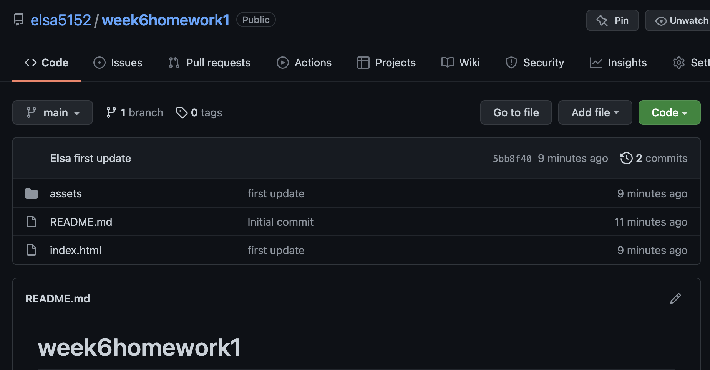
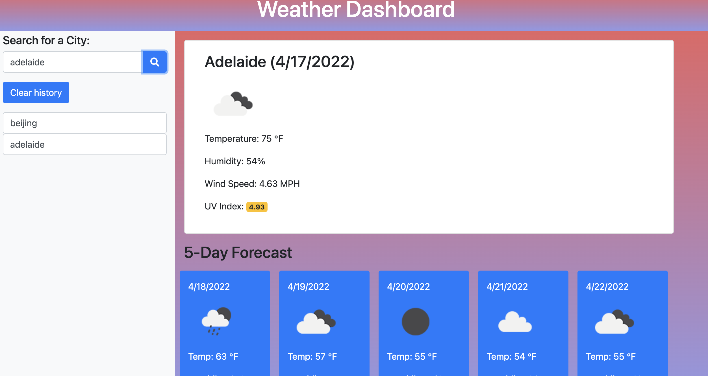

# week6homework

This is the detail for week6-homework.

* Create a new repository on my Github account and creat a README.md file.

* Create all the foler and file from github homework file.
* Write HTML, CSS and Javascript code in vs Code.
* Make sure the code meets the requirements.
* Always checking the result in webpage.

* Write the code in vs Code and upload it by gitpush.
* Update the code to the repo.
* Create a webpage link at github in setting

## Link my homework

[Weather Dashboard](https://elsa5152.github.io/week5homework/)